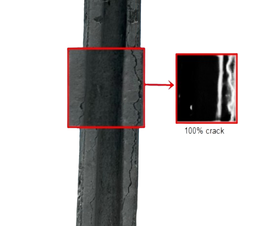

  

Tecnologias: 

  
  
  
  
  
  
  
  

# Desenvolvemos soluções com Inteligência Artificial 

## Projetos desenvolvidados 

### 1. Diagnostico de Hipotireoidismo com Inteligência Artificial Explicável

 

O hipotireoidismo é uma doença que afeta a tireoide, uma glândula localizada no pescoço, responsável por produzir hormônios que regulam o metabolismo do corpo. O diagnóstico precoce é fundamental para o tratamento da doença, que pode ser feito por meio de exames de sangue. O objetivo deste projeto é desenvolver um modelo de inteligência artificial que possa auxiliar no diagnóstico de hipotireoidismo, utilizando dados de exames de sangue. Além disso, o modelo deve ser capaz de explicar suas decisões, de forma a fornecer informações sobre os fatores que influenciaram o diagnóstico. 

#### Repositório do projeto 
[Diagnostico de Hipotireoidismo com Inteligência Artificial Explicável](https://github.com/cilab-ufersa/thyroid_disease_AI)

___

### 2. Detecção de Fissuras na Construção Civil com Visão Computacional 

A detecção de fissuras em estruturas de concreto é um problema importante na construção civil, pois as fissuras podem indicar problemas estruturais que comprometem a segurança das edificações. O objetivo deste projeto é desenvolver um sistema de visão computacional capaz de detectar fissuras em imagens de estruturas de concreto, utilizando técnicas de processamento de imagens e aprendizado de máquina. O sistema deve ser capaz de identificar a presença de fissuras, delimitar sua extensão e classificar sua gravidade, de forma a auxiliar engenheiros e arquitetos na inspeção das construções.

 

#### Repositório do projeto

[Crackit©: Crack analysis and diagnosis on buildings elements](https://github.com/cilab-ufersa/crack_detection_app) 

---

#### Support by 

  

